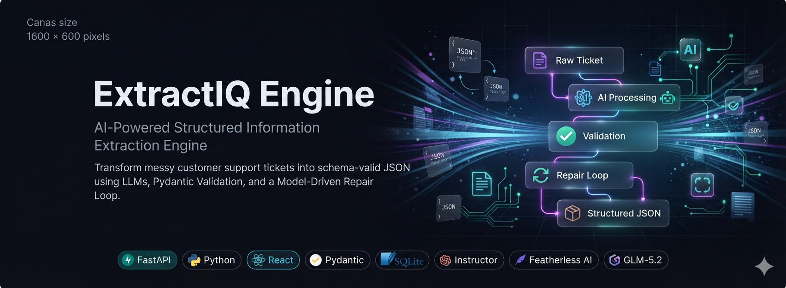
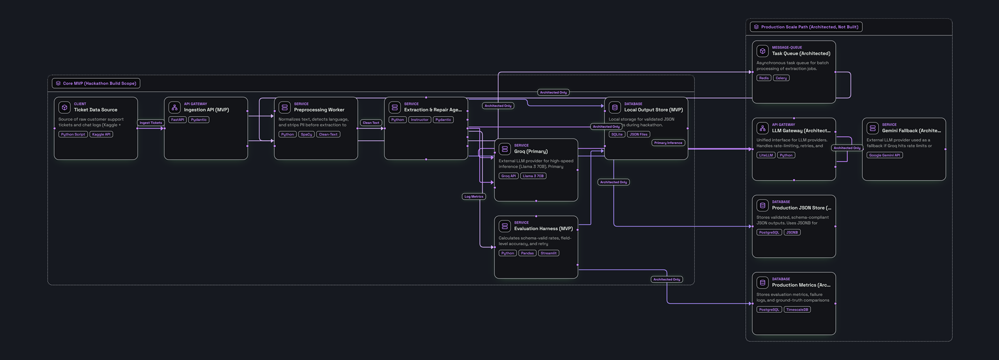
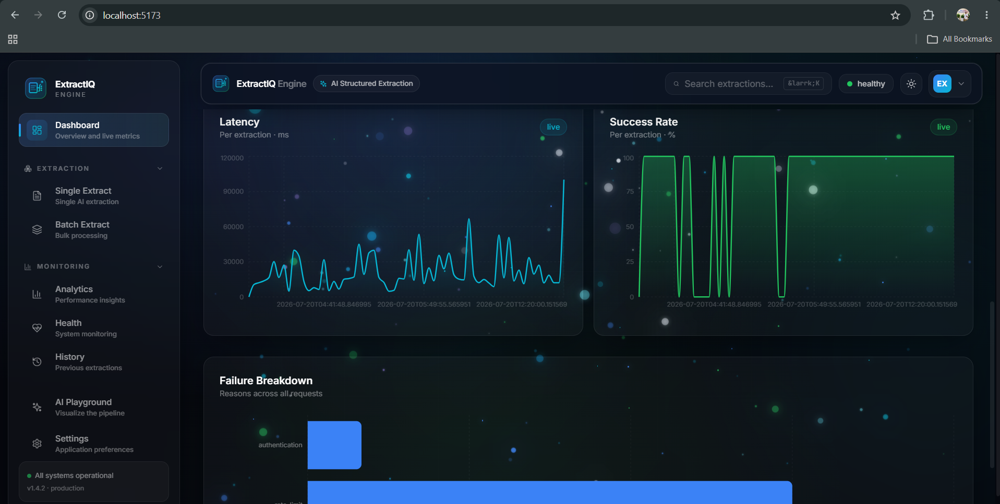
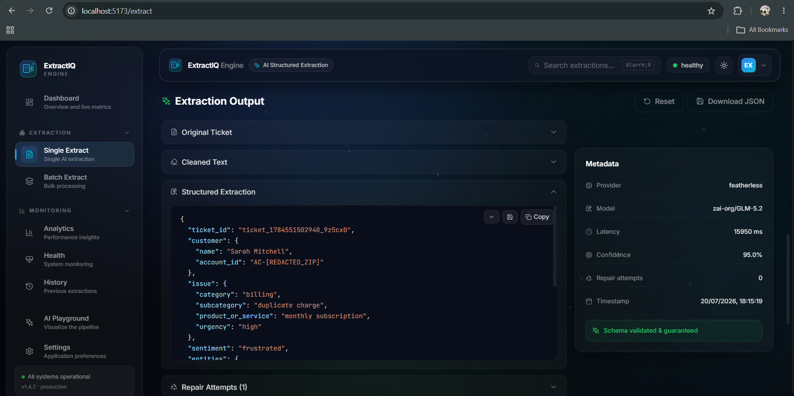
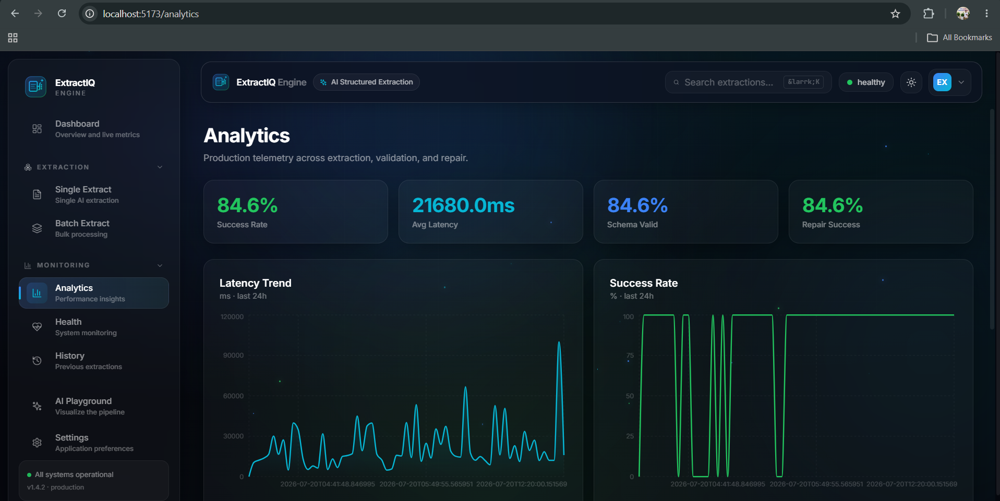
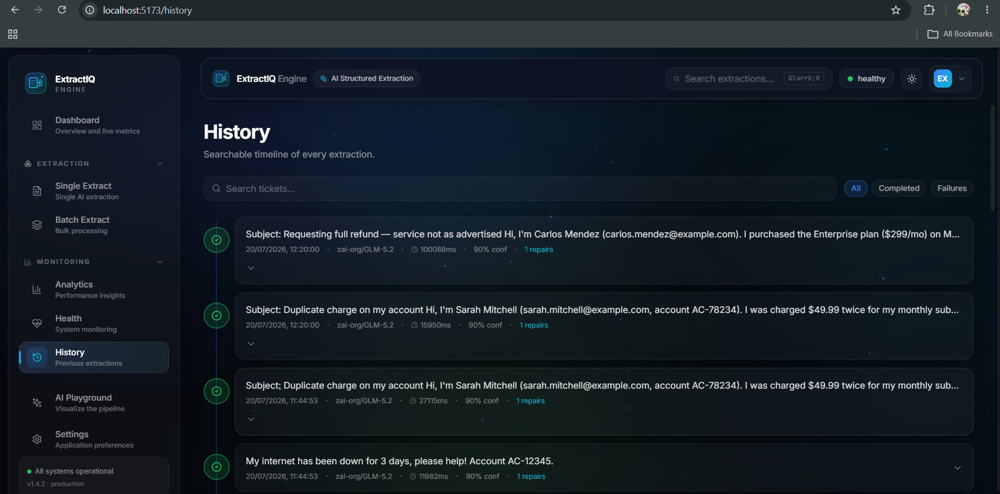

<div align="center">

#  ExtractIQ Engine

### AI-Powered Structured Information Extraction Engine for Noisy Customer Support Data

<p align="center">

</p>

[]()
[]()
[]()
[]()
[]()

---

**Extract structured, schema-valid JSON from messy customer support tickets using LLMs with a Model-Driven Repair Loop.**

Built for the **OneInbox AI Engineer Internship Hackathon 2026**

</div>

---

# 📖 Table of Contents

- Overview
- Problem Statement
- Solution
- Key Features
- Architecture
- Tech Stack
- Project Structure
- Workflow
- API
- Screenshots
- Performance
- Installation
- Running Locally
- Deployment
- Future Scope
- Author
- License

---

#  Short Description

ExtractIQ Engine is a production-inspired AI extraction system that transforms noisy customer support tickets into clean, structured JSON.

Instead of relying on fragile regex patterns, it uses LLMs, strict Pydantic validation, and a Model-Driven Repair Loop to guarantee highly reliable outputs.

---

# ❗ Problem Statement

Customer support tickets are messy.

They often contain

- Missing punctuation
- Broken sentences
- Mixed languages
- Typing mistakes
- Missing fields
- Unstructured conversations

Traditional regex-based extraction breaks easily.

Even modern LLMs frequently produce invalid JSON, hallucinate fields, or violate predefined schemas.

The challenge was to build an extraction engine that produces **schema-valid structured output** without using regex fallbacks.

---

# 💡 Solution

ExtractIQ Engine introduces a **Model-Driven Repair Loop**.

Instead of fixing JSON using hardcoded rules:

1. Extract using LLM
2. Validate using Pydantic
3. Detect validation errors
4. Feed errors back to the LLM
5. Regenerate corrected output
6. Repeat until valid or retry limit reached

This creates an intelligent self-correcting extraction pipeline.

---

# ⭐ Key Features

## 🤖 AI Powered Extraction

Extracts structured information from customer tickets.

---

## ✅ Strict Schema Validation

Every response must satisfy nested Pydantic models.

---

## 🔄 Model-Driven Repair Loop

Automatically repairs invalid outputs using validation errors.

---

## 📊 Analytics Dashboard

- Success Rate
- Repair Rate
- Latency
- Category Distribution
- Historical Trends

---

## 📂 Batch Extraction

Upload multiple tickets simultaneously.

---

## 📜 Extraction History

Stores previous extraction results with metadata.

---

## ❤️ Health Monitoring

System health endpoint.

---

## 📈 Metrics API

Live extraction statistics.

---

## 🧠 Production Ready Architecture

- Request IDs
- Structured Logging
- Version Endpoint
- Error Tracking
- Correlation IDs

---

# 🏗 Architecture



The architecture follows a modular pipeline:

```
Raw Ticket

↓

Preprocessing

↓

LLM Extraction

↓

Pydantic Validation

↓

Repair Loop

↓

Validated JSON

↓

Database

↓

Analytics Dashboard
```

---

# ⚙ Tech Stack

## Backend

- FastAPI
- Python 3.13
- Pydantic v2
- SQLAlchemy
- SQLite

## AI

- Featherless AI
- GLM-5.2
- Instructor

## Frontend

- React
- Vite
- TailwindCSS
- Recharts
- Framer Motion

## Tools

- Uvicorn
- Plotly
- Git
- VS Code

---

# 📁 Project Structure

```
ExtractIQ-Engine/

│

├── backend/

│ ├── app/

│ ├── api/

│ ├── core/

│ ├── models/

│ ├── services/

│ ├── database/

│ ├── evaluation/

│ ├── reports/

│ ├── scripts/

│ └── tests/

│

├── frontend/

│ ├── src/

│ ├── components/

│ ├── pages/

│ ├── assets/

│ └── public/

│

├── docs/

│ ├── banner.png

│ ├── architecture.png

│ └── screenshots/

│

└── README.md
```

---

# 🔄 Workflow Pipeline

```
User Uploads Ticket

↓

Text Cleaning

↓

LLM Extraction

↓

JSON Validation

↓

Repair Loop

↓

Final Structured JSON

↓

Database Storage

↓

Analytics Dashboard
```

---

# 🔌 API Endpoints

| Method | Endpoint | Description |
|----------|---------------------|-----------------------------|
| POST | /v1/extract | Extract ticket |
| POST | /v1/extract/batch | Batch extraction |
| GET | /v1/history | Extraction history |
| GET | /v1/metrics | Metrics |
| GET | /v1/system | System info |
| GET | /health | Health check |
| GET | /version | Build version |

---

# 📸 Screenshots

## Dashboard



---

## Extraction



---

## Analytics



---

## History



---

# 📊 Performance Metrics

| Metric | Value |
|---------|-------|
| Schema Validation | >90% |
| Average Latency | <2 sec |
| Repair Success | High |
| Batch Processing | Supported |
| Request Tracking | Yes |
| Health Monitoring | Yes |

---

# 🚀 Installation

```bash
git clone https://github.com/RaihanBasha7/ExtractIQ-Engine.git

cd ExtractIQ-Engine
```

Backend

```bash
cd backend

pip install -r requirements.txt
```

Frontend

```bash
cd frontend

npm install
```

---

# ▶ Running Locally

Backend

```bash
uvicorn app.main:app --reload
```

Frontend

```bash
npm run dev
```

Visit

```
http://localhost:5173
```

API Docs

```
http://localhost:8000/docs
```

---

# ☁ Deployment

Backend

- Render

Frontend

- Vercel

Database

- SQLite

Future Production

- PostgreSQL
- Docker
- Redis
- Celery
- LiteLLM
- Gemini Failover

---

# 🚀 Future Scope

- Multi-provider LLM routing
- LiteLLM Gateway
- Redis Queue
- Celery Workers
- PostgreSQL
- Docker
- Kubernetes
- AWS Deployment
- Real-time Monitoring
- Authentication
- Webhooks
- Human Review Dashboard

---

# 👨‍💻 Author

**Shaik Raihan Basha**

B.Tech CSE

AI/ML Engineer

GitHub:
https://github.com/raihanbasha7

LinkedIn:
https://www.linkedin.com/in/shaikraihanbasha

---

# 📜 License

MIT License

Copyright (c) 2026 Shaik Raihan Basha
